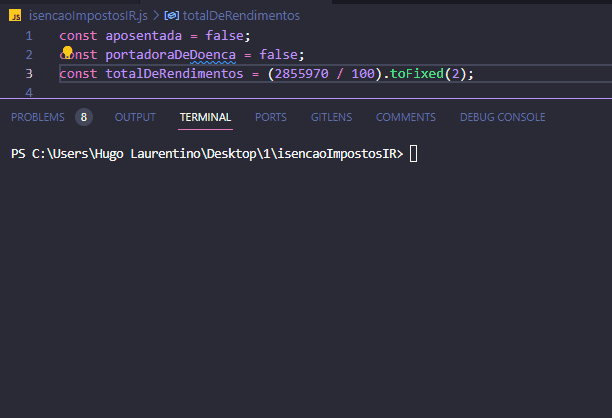

<h1 align="center">
  
</h1>

- [x] Bak-End
- [x] Criar Título
- [x] Criar Descrição
- [x] Sobre
- [x] Tecnologia
- [x] Pre requisito
- [x] Autor
- [x] GIF‘s

---
<h1 align='center'>Isenção de Impostos (IR)</h1>

<p align='center'>Esse é um exemplo de lógica em javascript</p>
<p align='center'>
 Faça um programa que determine se a pessoa deve pagar IR ou não.

- Caso a pessoa não deva pagar IR por pertencer ao grupo de pessoas isentas, imprima na tela ISENTA
- Caso a passoa não deva pagar IR por nao ter o rendimento mínimo necessário, imprima na tela VAZA LEAO! JA TA DIFICIL SEM VOCE
- Caso a pessoa deva pegar IR imprima na tela PEGA LEAO
</p>

<p align='center'>
 <a href='#sobre'>Sobre</a> |
 <a href='#pré-requisitos'>Pre Requisitos</a> |
 <a href='#tecnologias'>Tecnologias</a> |
 <a href='#autor'>Autor</a>
</p>

---
<h1 align='center'>
 
</h1>

---

### Sobre

  <p align= 'justify'>
  Segundo a receita federal, algumas pessoas são isentas do pagamento de imposto de renda (IR). Simplificamos aqui quem são essas pessoas:

- Pessoas portadores de alguma doença grave
- Pessoas que já estão aposentadas
- Para pessoa não esteja isenta, avalia-se seus rendimentos tributáveis ao longo do ano. Na condição em que o total de rendimentos seja superior a R$ 28.559,70, a pessoa deve pagar imposto de renda, caso contrário, não.
  </p>

---

### Pré-requisitos

Antes de começar, você vai precisar ter instalado em sua máquina as seguintes FERRAMENTAS: [GIT](https://git-scm.com/), [Node.js](https://nodejs.org/en/download).
Além disto é bom ter um editor para trabalhar com o código como [VSCode](https://code.visualstudio.com/download).

### 🎲 Rodando o Back End

```bash
# Clone este repositório
$ git clone https://github.com/hugolaurentino/isencaoImpostosIR.git

# Acesse a pasta do projeto no terminal/cmd
$ cd isencaoImpostosIR

# Instale as dependências
$ npm install

# Execute 
$ node .\isencaoImpostosIR.js

```
### Tecnologias

As seguintes ferramentas foram usadas na construção do projeto:

- [Node.js][nodejs]

---
###### tags: `lógica` `matemática` `nodeJS`
## Autor
Feito com ❤️ por Hugo Laurentino 👋🏽 [Entre em contato!](https://www.linkedin.com/in/hugo-laurentino-silva/)

[nodejs]: https://nodejs.org/
